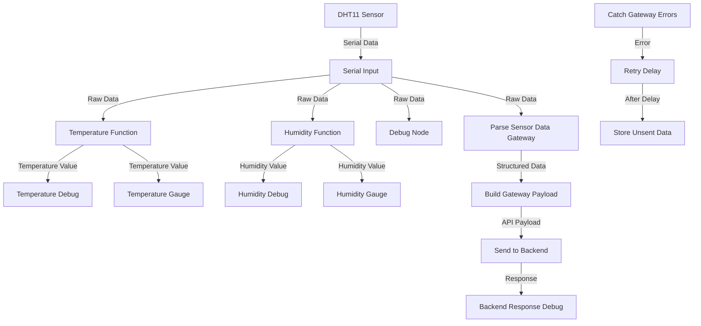
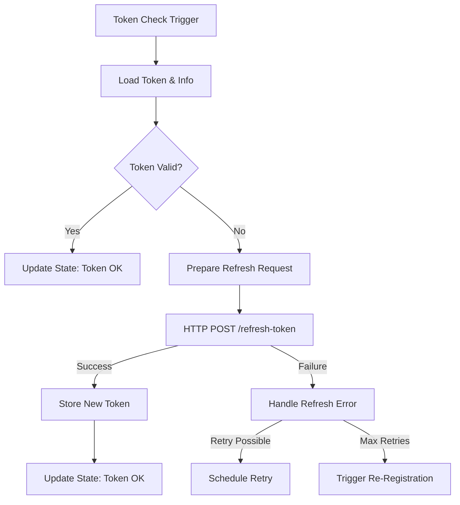
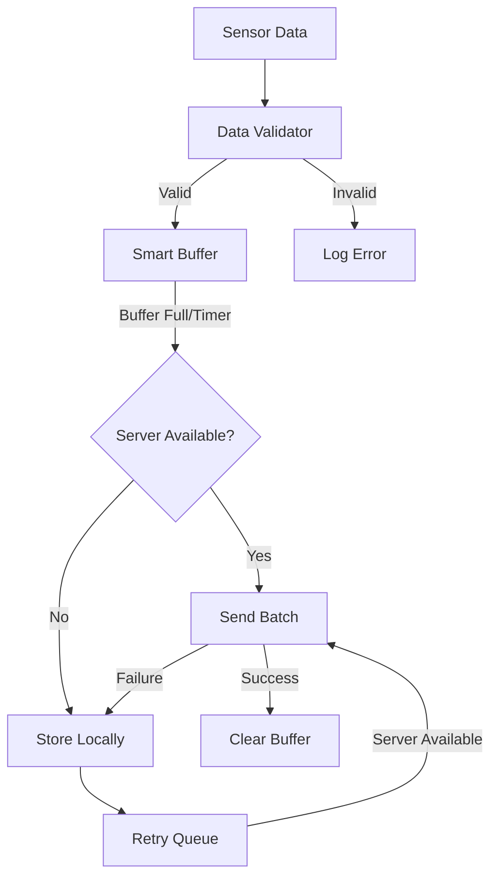
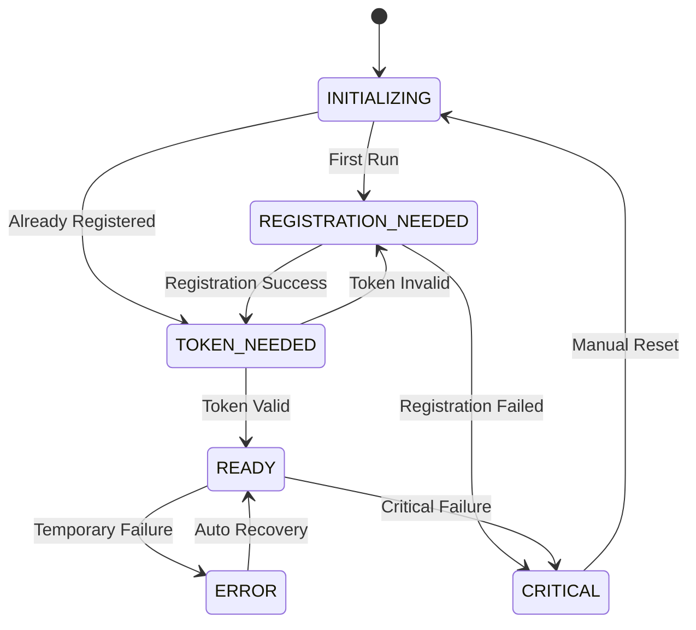
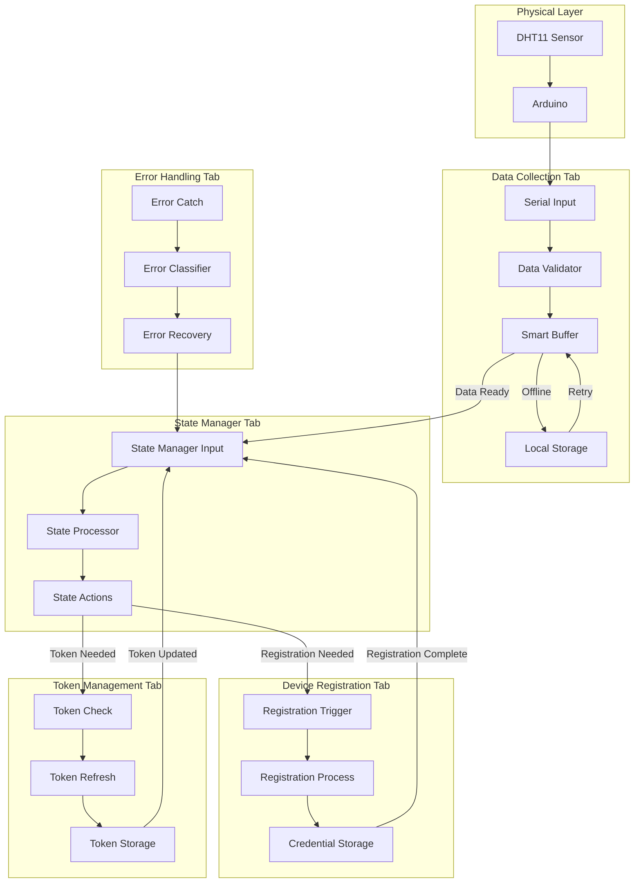

# IoT Monitoring System - Current Implementation and Future Roadmap

## 1. Current Implementation (flow1)

### 1.1. System Overview
The current implementation in flow1.json provides a basic IoT monitoring system that:
- Collects temperature and humidity data from a DHT11 sensor connected to an Arduino
- Processes and displays the sensor readings through a Node-RED dashboard
- Transmits data to a backend server via HTTP requests
- Implements basic error handling with a catch node for gateway errors

### 1.2. Current Architecture


### 1.3. Component Details

#### 1.3.1. Data Collection
- **Serial Input**: Collects data from Arduino on COM9 at 9600 baud
- **Temperature Function**: Parses JSON, extracts temperature value
- **Humidity Function**: Parses JSON, extracts humidity value
- **Debug Node**: Displays raw data for troubleshooting

#### 1.3.2. Data Visualization
- **Temperature Gauge**: Displays current temperature in Celsius
- **Humidity Gauge**: Displays current humidity percentage

#### 1.3.3. Gateway Functionality
- **Parse Sensor Data**: Transforms raw serial data to structured JSON
- **Build Gateway Payload**: Adds metadata (timestamp, sensor ID)
- **Send to Backend**: HTTP POST request to backend API (https://80.211.202.159:8444/api/sensors)

#### 1.3.4. Error Handling
- **Catch Gateway Errors**: Intercepts errors from HTTP requests
- **Retry Delay**: Waits 5 seconds before retrying
- **Store Unsent Data**: Saves failed transmissions to local storage

### 1.4. Current Limitations
- No token management or authentication mechanism
- Limited error handling and recovery
- No offline data buffering beyond basic error retry
- No state management across system components
- No device registration process

## 2. Future Implementation

### 2.1. Overview of Planned Enhancements
The future implementation will transform the basic flow1 into a robust, production-ready IoT system with:
- Comprehensive state management
- Secure authentication with token management
- Smart buffering for offline operation
- Advanced error handling and recovery
- Modular, tab-based architecture for maintainability

### 2.2. Token Management & Re-login

#### 2.2.1. Token Management Flow


#### 2.2.2. Token Management Components
- **Automatic Token Validation**: Regular token checks (every 2 hours)
- **Token Refresh**: Automatic refresh of expired tokens
- **Token Storage**: Secure storage with file persistence
- **Retry Logic**: Exponential backoff for temporary failures
- **Re-login Mechanism**: Trigger device registration if token refresh fails permanently

#### 2.2.3. Token Data Structure
```json
{
  "token": "eyJhbGciOiJIUzI1NiIsInR5cCI6IkpXVCJ9...",
  "refreshToken": "eyJhbGciOiJIUzI1NiIsInR5cCI6IkpXVCJ9...",
  "expiresAt": "2024-05-16T14:30:00Z",
  "deviceId": "device-001"
}
```

### 2.3. Offline Data Storage

#### 2.3.1. Smart Buffer Flow


#### 2.3.2. Smart Buffer Components
- **Data Validator**: Ensures data integrity before buffering
- **Buffer Manager**: Collects readings, enforces max size/age
- **Server Availability Check**: Verifies backend connectivity
- **Local Storage Manager**: Persists data when offline
- **Retry Mechanism**: Automatically sends stored data when connection is restored

#### 2.3.3. Offline Storage Strategy
- **Memory Buffer**: Primary storage for recent readings
- **File Storage**: Persistent JSON storage for offline operation
- **Storage Limits**: Maximum size and age policies
- **Batched Transmission**: Multiple readings sent in single request
- **Prioritization**: Newest data sent first when connection restored

### 2.4. State Management

#### 2.4.1. State Machine Diagram


#### 2.4.2. State Manager Components
- **State Context**: Central store for system state
- **State Transition Logic**: Rules for state changes
- **Event Processor**: Handles events from all components
- **Action Trigger**: Initiates appropriate actions based on state

#### 2.4.3. State Persistence
- **File-backed Context**: Survives Node-RED restarts
- **State History**: Records transitions for troubleshooting
- **Component States**: Tracks individual component statuses

### 2.5. Complete Future Architecture



## 3. Implementation Approach

### 3.1. Migration Strategy
To migrate from the current flow1 to the future architecture:

1. **Preserve Current Functionality**: Keep existing sensor integration
2. **Add Components Incrementally**: Start with State Manager and Registration
3. **Gradually Replace Parts**: Substitute basic functions with advanced components
4. **Test in Parallel**: Run new components alongside existing ones
5. **Final Switchover**: Once all components are tested and reliable

### 3.2. Implementation Priorities
1. **State Manager**: Foundation for coordinating all components
2. **Token Management**: Security layer for API access
3. **Smart Buffer**: Offline operation capability
4. **Error Handling**: Robust recovery mechanisms
5. **UI Improvements**: Enhanced dashboard for monitoring

### 3.3. Configuration Management
- **Development**: Hardcoded values during development
- **Testing**: Environment variable configuration
- **Production**: Configuration stored in secure context

## 4. Testing Strategy

### 4.1. Component Tests
- **Token Management**: Test token validation, refresh, storage
- **Smart Buffer**: Test buffer limits, data persistence, retry logic
- **State Manager**: Test all state transitions and actions
- **Error Handling**: Test recovery from various failure scenarios

### 4.2. Integration Tests
- **End-to-End Flow**: Data collection through transmission
- **Recovery Scenarios**: Service outages, network issues
- **Performance**: Resource usage, data throughput

### 4.3. Simulated Conditions
- **Network Disruption**: Disconnected/intermittent internet
- **Server Failure**: Backend API unavailable
- **Token Expiration**: Authentication failures
- **Hardware Issues**: Sensor disconnection

## 5. Conclusion

The current flow1 implementation provides basic IoT monitoring functionality but lacks robustness for production use. The planned enhancements will transform it into a resilient, secure system capable of handling real-world challenges like network disruptions and authentication requirements.

By implementing the token management, offline storage, state management, and error handling components, the system will achieve:
- **Reliability**: Continue functioning during network/server issues
- **Security**: Maintain secure authentication with the backend
- **Maintainability**: Modular design for easier updates and debugging
- **Scalability**: Architecture supporting additional sensors and features

This documentation serves as both a reference for the current implementation and a roadmap for future development. 